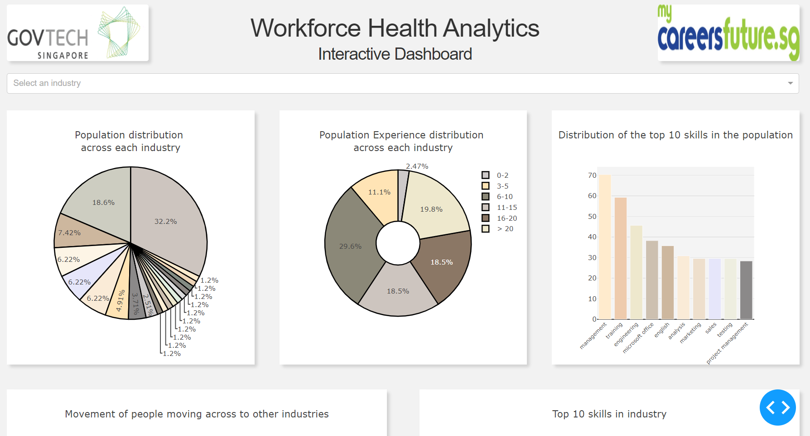

# BT3101 Capstone Project: Personal Identifiable Information (PII) Advisor

### Background:

Govtech’s MyCareersFuture team is facing challenges understanding unstructured data in resumes on [Singapore's national job portal](https://www.mycareersfuture.sg/). They wish to improve how personally identifiable information (PII) in resumes are handled, which would minimise the costs of any data leakage or security breach.

In collaboration with NUS School of Computing (Business Analytics), Govtech has developed a PII advisor which alerts administrators about, flags out, and masks PIIs in resumes and enable classification of documents according to their level of confidentiality.

### Technical Documentation:

The main directory is split into 3 key components:
- [Software Engineering](./Software_Engineering)
- [Data Science](./data_science)
- [Dashboard](./Dashboard)

#### [Software Engineering](./Software_Engineering)

The software directory is the most important, where it houses productionised data science codes, together with docker configurations that can be launched to create an API that can receive resume files and return parsed results. 

##### Key Commands

###### Building the Image

Run the following to build the Docker image:

```sh
make build;
```

###### Starting a complete environment

Run the following to run the image with a complete expected setup:

```sh
make start;
```

To run a sample:

```sh
curl -vv localhost:5000/0011.doc;
```

More details in [Software Engineering directory](./Software_Engineering)

#### [Data Science](./data_science)

The data science folder stores the data science codes and unit tests. It is mainly used for research and development on methods to improve parsing, and any machine learning models that were tested.

For our model, we used a pretrained model from [Dataturks](https://dataturks.com/projects/abhishek.narayanan/Entity%20Recognition%20in%20Resumes) as our baseline. To create an improved model that can work better with Singaporean resumes, the NUS team has trained it with local resumes.

This directory contains:
[Dataturk's pre-trained model and application code](./data_science/model_building)
[Unit Tests](./data_science/unit_tests)

As well as some jupyter notebooks used in the research and development phase of our project.

** Note that the files in [Data Science](./data_science) are decoupled from those in [Software Engineering](./Software_Engineering), hence changes only made in [Data Science](./data_science) directory would not be propagated. 

The key files in [Software Engineering](./Software_Engineering) that contains code from here is found in `convert_to_text.py` and `process_string.py`.

#### [Dashboard](./Dashboard)

The dashboard folder contains a prototype of what could be visualised after analysing the results of the PII advisor. These charts were conceptualised based on client feedback and available data.



At the moment, there is no ETL process that converts the parsed resumes to dashboard visualisations.

This directory contains:
[Dataturk's pre-trained model and application code](./data_science/model_building)
[Unit Tests](./data_science/unit_tests)

#### Contributors

- Govtech Project Lead: zephinzer (Joseph Matthias Goh)

- NUS Students: 
- Lee Chen Yuan
- Markus Ng
- Ang Kian Hwee
- Sheryl Ker
- Tong Tsz Hin (Tony)